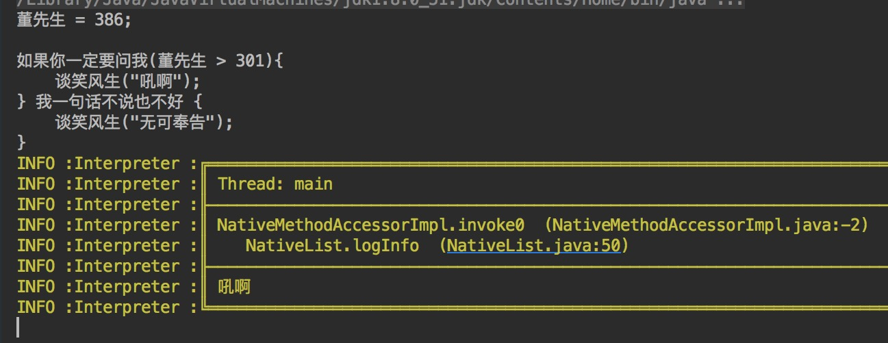

# HobbyScript - Ha Branch

Exercise for learn knowledge about computer language compile.

> Transport from my another lib [CodeParser](https://github.com/lfkdsk/CodeParse).
>
> Dev TimeLine :  [TimeLine](TimeLine.md)
>
> 科科 所谓蛤语言

[](https://jitpack.io/#lfkdsk/HobbyScript)

### With Gradle

Step 1. Add the JitPack repository to your build file

``` groovy
	allprojects {
		repositories {
			...
			maven { url "https://jitpack.io" }
		}
	}
```

Step 2. Add the dependency

``` groovy
	dependencies {
	        compile 'com.github.lfkdsk:HobbyScript:v1.0'
	}
```

### Introduction

>如果想了解正经的编译原理的学习和实现可以参考：
>
>1. [master-branch](https://github.com/lfkdsk/HobbyScript) 项目的主分支一种弱类型语言的解释器和局部中间代码编译器的实现。
>2. [hh-runtime](https://github.com/lfkdsk/HobbyScript/tree/hh-runtime) 正在通过将HobbyScript转换到Java然后运行在JVM上的分支。
>3. [time-line](https://github.com/lfkdsk/HobbyScript/blob/master/TimeLine.md) 开发过程中的TimeLine
>4. [若梦浮生](http://lfkdsk.github.io/) 我的博客里有相关的博文。

我的经历呢，就是上学期上过了编译原理这门课，然后参照学过的知识开发了HobbyScript这个只有学习性和练习性的编程语言。看到逼乎上有人发图在C++里通过宏定义实现的膜法（大概是什么鬼的中文编程的问题里的回答）。然后呢我就修改了词法分析里面的正则匹配模式（没错，词法分析偷懒用了正则＝－＝），抓取中文token，就有了[hh-zh](https://github.com/lfkdsk/HobbyScript/tree/hh-zh) 这个实现“中文编程”的奇怪分支。

之后我就想搞一门从词法分析开始的膜法而不是只使用宏定义，之前master分支已经写好了，所以修改只需要修改一些Token 规则就可以了，然后我就提交了一份"branch for ha" ，仅供娱乐。修改“hh-ha”大概做了三件事：

1. 修改正则规则
2. 修改Token关键字和native函数关键字
3. +1s

### 语法规则

语法部分参考 [time-line](https://github.com/lfkdsk/HobbyScript/blob/master/TimeLine.md) 的语法规则部分。

### 关键字对照表

由于这个分支是从之前的版本分出来的所以真值类型的支持有问题233333。

| Token                    |  HaToken  |
| :----------------------- | :-------: |
| if                       | 如果你一定要问我  |
| else                     | 我一句话不说也不好 |
| while                    |   问来问去    |
| function                 |   搞个大新闻   |
| true                     |    吼啊     |
| false                    |   没听说过    |
| break                    |  跑得比谁都快   |
| closure                  |   人生经验    |
| class                    |   西方那一套   |
| initial                  |    扬州     |
| this                     |     续     |
| super                    |    长者     |
| import                   |    滋词     |
| logInfo(native function) |   谈笑风生    |

我还没想好for关键字应该怎么设定，大家来众筹啊！

### Picture

运行图：



## License

    Copyright 2015 [刘丰恺](http://www.cnblogs.com/lfk-dsk/)

    Licensed under the Apache License, Version 2.0 (the "License");
    you may not use this file except in compliance with the License.
    You may obtain a copy of the License at
    
       http://www.apache.org/licenses/LICENSE-2.0
    
    Unless required by applicable law or agreed to in writing, software
    distributed under the License is distributed on an "AS IS" BASIS,
    WITHOUT WARRANTIES OR CONDITIONS OF ANY KIND, either express or implied.
    See the License for the specific language governing permissions and
    limitations under the License.


