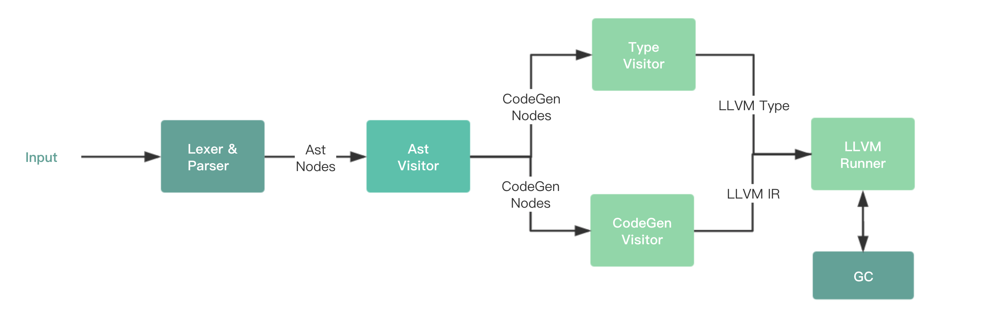

**本篇文章你会学到**

- 使用 LLVM 作为后端的编程语言的架构设计方式。
- LLVM Cpp API 和相应基础设施的使用方法。
- 完备的测试设计手段和可视化验证 debug 方案。
- 一个丰富的 LLVM Playground 可供开发练习使用。

## 背景

编写这个 LLVM Backend 系列项目和文章的初衷是因为 [HobbyScript](https://github.com/lfkdsk/HobbyScript) 这个几年前做的语言项目，当时是通过构建了一套 JVM 平台上的 [Bnf-Ast](https://github.com/lfkdsk/bnf-ast) Parser Combinator 工具。用这套工具编写了在运行时生成的 Parser ，将识别的输入语言生成出对应的 JVM Object 构建出 Ast 结构。随后根据生成的 Ast 结构尝试实现了：

1. 直接使用 JVM 语言编写处理 eval；
2. 生成部分三地址指令集，并实现了对应的部分函数的 JIT；
3. 直接生成 JVM Code，成为一个 JVM 语言
4. [（把 Lexer Token 改成中文用来膜和嘲讽中文编程民科）](https://github.com/lfkdsk/HobbyScript/blob/hh-ha/src/HobbyScript/Parser/ScriptParser.java#L24)

其余的还有一些通过 graphz 生成的数据可视化展示的功能，如下图：

不过以上虽然玩了很多的花活，但是仍然在 JVM 的编写范畴之内。随着前一段时间读了读 CPython （Python 的 C-Backend，也算个 VM）的一部分代码，并且也学习了下 LLVM 的一些知识，因此这里就是试着给这个语言增加一个 LLVM Backend。为语言增加 LLVM Backend ，首选的其实是应该考虑 JVM 上的 LLVM Binding ，比如 [JavaCPP Presets for LLVM](https://github.com/bytedeco/javacpp-presets/tree/master/llvm) ，但是目前可用的 Binding 只有 C API，单从 IR Builder 的角度来讲 LLVM 的 C API 要比 Cpp API 多写很多麻烦的代码才能完成相同的事情，并且 JVM 调用 JNI 包装的 Cpp 程序产生的 Segment Fault 也很难调试。

因此这个流程之中还是简单的在 cpp 侧用工具简单做了个 codegen 生成 parser ，之后可以考虑把 parser 部分的 api 收敛将 JVM 侧的 ast 结构直接 call 进 cpp 部分的 IR Builder。不过现在我们还是在 cpp 侧完成完整的流程，整个过程之中我们不会非常专门的去介绍 LLVM 的相关知识，但是当我们能够用到的时候都会对相应的知识去讲解。

## 基础设施

### 技术选型

1. LLVM Cpp Api：7.0
2. Cpp ：14 ~ 17 （部分的特性在 17 之中被禁止需要）
3. 构建工具：cmake （仍然不好用，写了一些 git 脚本，大部分库都是用这个脚本依赖的）
4. 测试库：google test
5. 部分的依赖库：rapidjson、spdlog、imgui、qtcore（用来替代 std）

### 整体结构

上图就是整个由 LLVM Backend 的语言项目目前的数据流图。

## Compiler Frontend：Parser 实现

### Lexer && Parser 

### Object 层接口实现

### 实现 Visitor 工具

### AST 生成

## 构建测试驱动

### 测试 AST 生成结构

### 测试 Graph 生产图的数据结构

## Compiler Backend：代码生成

### CodeGen 层生成

### LLVM 简单基础知识

### 构建 LLVM Type

### LLVM Builder 生成

## 拓展 Runtime

### 构建 GC

### 编写 Plugins 加载

### 编写 String 类型的 Clang 实现

## 运行 LLVM Runner 

